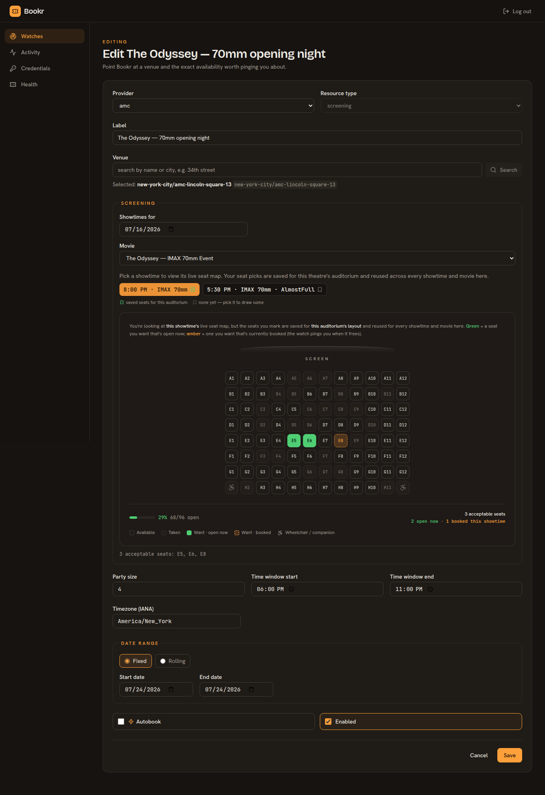
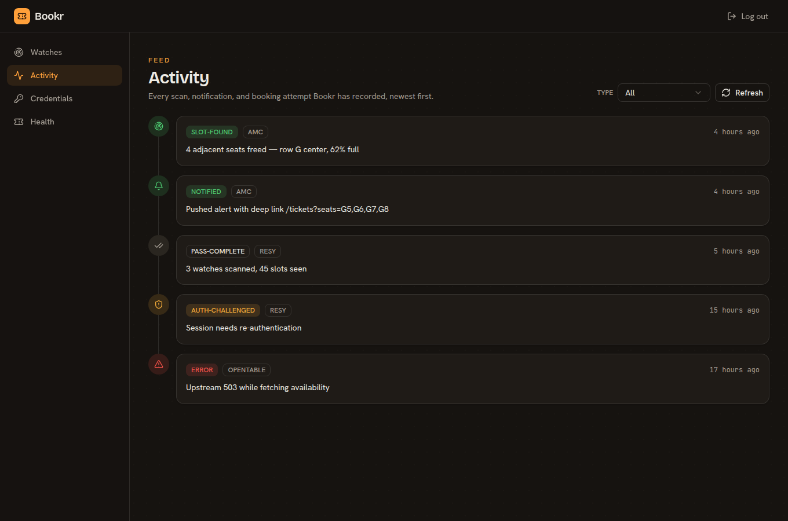

<p align="center">
  
</p>

A pluggable reservation scanner. It watches a booking provider for newly-freed
inventory — a cancelled table, seats opening up in a sold-out screening — within
a target date/time window and alerts you, optionally auto-booking. Providers so
far: **Resy** (restaurants) and **AMC Theatres** (movie screenings); the design
is provider-agnostic so more (e.g. SoHo House) drop in as one module.

## Design at a glance

- **Notify-first.** By default Bookr alerts you with a one-tap deep link.
  Auto-booking is a per-watch opt-in (`autobook`, default off; capability-gated
  per provider — AMC is notify-only).
- **Seat-aware.** For assigned-seating providers, watches carry seat
  preferences: draw your acceptable seats on the dashboard's seat-map picker
  (remembered per theater) and Bookr alerts only when a contiguous block big
  enough for your party opens up *in those seats* — with occupancy context
  ("62% full; best: 4 adjacent, row G center") and a deep link that pre-selects
  the block.
- **Two swappable abstractions:**
  - `BookingProvider` — `resy`, `amc`, others plug in. Selected per watch.
  - `CredentialsProvider` — `env` (default, works for anyone) or `vaultwarden`.
    Selected by `CREDENTIALS_PROVIDER`. No personal config lives in source.
    (AMC needs no credentials at all — its catalog is read anonymously.)
- **Self-servicing credentials.** The server logs in and refreshes tokens itself;
  if a login is challenged it alerts you and accepts a fresh token pushed to an
  authenticated ingest endpoint — usable from anywhere.
- **Stack:** TypeScript · Express (API + scheduler) · React + Vite (dashboard) ·
  SQLite (better-sqlite3) · pnpm workspaces. Notifications via
  [apprise](https://github.com/caronc/apprise).

## Dashboard

A React + Vite control room for your watches — light/dark aware (follows your OS), mobile-ready,
and built on a seat-aware design system. Draw the exact seats you'll accept on a live auditorium
map (remembered per theater), and read a timeline of every scan, notification, and booking attempt.

<p align="center">
  
</p>

<p align="center">
  
</p>

## Layout

A pnpm workspace. The domain logic lives in `packages/core` behind ports; every entry point
(`apps/*`) is a thin adapter over the same application surface.

```
packages/shared    TS types + zod schemas — the vocabulary every package shares
packages/core      domain logic: ports, services, scan engine, scheduler, and the
                   provider / credentials / notifier / persistence adapters
packages/testkit   in-memory port fakes for tests
packages/fixtures  captured provider API responses for tests
apps/server        Express API + polling scheduler + static dashboard host
apps/web           React + Vite dashboard
apps/cli           command-line interface over the application
apps/mcp           Model Context Protocol server (stdio + streamable HTTP)
tools/login        off-box headed login → pushes a token to the ingest endpoint
```

## Getting started

Requires Node 22+ and pnpm.

```sh
cp .env.example .env   # fill in creds (or set CREDENTIALS_PROVIDER=vaultwarden)
pnpm install
pnpm scan              # one scan pass (dev)
```

### Common commands

```sh
pnpm cli -- --help     # CLI usage (watches, scan, book, …)
pnpm dev:server        # run the API + scheduler
pnpm dev:web           # run the dashboard
pnpm ci                # typecheck + lint + test across the workspace
```

See `.env.example` for configuration and `deploy/README.md` for running the container.

## API documentation

Every exported symbol carries TSDoc (lint-enforced). Generate a browsable
[TypeDoc](https://typedoc.org) reference across all workspace packages with `pnpm run docs`.
